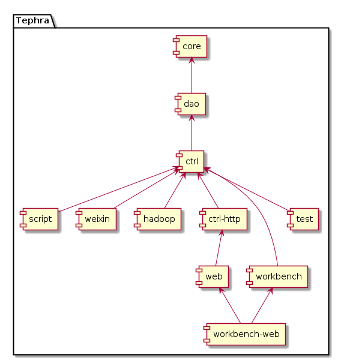

Tephra取火山灰之意，因为当初好像刚好有个火山喷发了，而且觉得火山灰是一个毁灭者，但同时又是一个创造者。他毁灭了旧的体系，然后开始用他自己的养分创造新的体系。目前看来，他确实已经毁灭了我之前的架构（封印在SVN上很久了），接下来就看看他如何创建一个新的体系了。

先说说核心思想，我一直向开发人员推荐面向接口的编程思想，因为我觉得这是一个很Nice的指导方向，可以让你的代码更加简洁，读之欣然。

混合Scala编程是一个大胆的尝试，可以弥补Java的一些弱点；当然，主要还是基于Java开发，至少一开始如此。

Spring仍旧是核心的组件，当然仍旧没有使用太多的Spring，因为我觉得Spring后面的很多功能已经背离了早先的设计思想，变成一个想包罗万象的大家伙。Tephra中对于Spring的使用仍旧仅局限于IoC和AOP，因为我觉得这哥俩才是Spring最吸引人的地方。

Hibernate是后来又补上的，最早的版本没有是因为第一个版本是为游戏服务器架构的，唯快不破的准则放弃了Hibernate，而后面增加回来是基于后台管理功能的需要。这一过程纠正了我一个开发框架中只能存在一个ORM的想法。没人规定不可以，是吧？！

Struts一开始就被放弃了，主要是因为安全漏洞太多了。然后根据自己多年使用Struts的经验和习惯，开发了专属于Tephra的控制层，功能简单，但是高效。因为没有像OGNL那么强大的参数映射功能，所以类似的安全漏洞应该不存在；不过为了调试方便后门还是需要的，有上锁了，应该是安全的。

JSON成为了Tephra最主要的数据传输格式，轻量、跨平台、跨终端，别无他选，至少目前如此。

最后说说Maven，确实比Ant进步不少，也许这也是一个毁灭旧体系，创建新体系的过程吧。

[部署蓝图](doc/deploy.md) | [快速开始](doc/start.md)

# 特性

Tephra旨在构建一个稳定、高效、易于集群、快速扩展的JavaEE开发框架。目前，Tephra已经具备了以下特性：

- 提供类级别的热更新，但仅建议在需要快速修正严重BUG、并且无法立即进行全更新时使用。
- 提供全冗余方式的缓存，自动在每个节点间同步缓存数据，而每个节点都仅从本地内存中获取缓存数据，从而提供高效的执行效率，并且当部分节点宕机时仍旧能正常提供服务。当然，也允许使用Redis提供统一的中心节点缓存。此特性可用于多节点负载时提供不停服更新。
- 提供数据库读写分离、及读负载均衡，并且允许配置多个不同的数据库，甚至允许在运行期间增加新的数据库配置，并自动映射ORM。允许执行标准的SQL或存储过程，同时提供了一个简单、轻量的ORM工具，并集成Hibernate、MyBatis为复杂ORM需求提供支持。
- 提供MongoDB工具实现对NoSQL的支持，支持负载均衡。
- 提供轻量级的控制器，并且允许设置最大并发峰值，以确保在突如其来的并发攻击后能继续正常提供服务。允许发布为HTTP(S)、WebSocket、Socket服务。
- 提供JavaScript脚本引擎支持，允许JavaScript与JavaBean自由交互，并且可以发布JavaScript为服务；以及使用Javacript作为复杂规则验证器。
- 提供Hadoop存取支持。
- 模块化开发，使用注解简化配置，增强代码可读性与维护性。

# 组件图

# 模块说明
- [core](tephra-core/)——基础模块。
- [dao](tephra-dao/)——持久化模块。
- [ctrl](tephra-ctrl/)——控制层模块。
- [ctrl-http](tephra-ctrl-http/)——HTTP(S)模块。
- [script](tephra-script/)——脚本（JavaScript）模块。
- [weixin](tephra-weixin/)——微信公众号模块。
- [test](tephra-test/)——单元测试模块。

