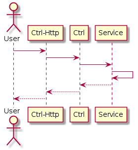

# Ctrl-Http简介
Ctrl-Http模块提供基于HTTP协议的请求处理，并将请求提交给Ctrl进行调度处理。



## 安全过滤器
Ctrl-Http模块提供了一个安全过滤器，用于对一些Web攻击进行处理，可以通过以下参数设置是否启用，启用时如果涉及安全隐患的，将直接返回404状态。
```properties
## 设置是否允许执行JSP脚本。
## 如果设置为true则表示允许。
## 如果设置为false则表示不允许。
#tephra.ctrl.http.security.jsp.enable = false
## 设置是否自动过滤XSS攻击脚本数据。
## 如果设置为true则表示自动过滤XSS攻击脚本内容。
## 如果设置为false则表示不过滤。
#tephra.ctrl.http.security.xss = true
## 设置XSS过滤忽略URI地址集，多个间以逗号分隔。
#tephra.ctrl.http.security.xss.ignore =
```
## 静态资源304处理
Ctrl-Http模块自动对静态资源进行最后更新时间的判断，如果客户端当前资源已为最新时，将直接返回304，而不再返回数据，以加快请求响应，降低服务器压力。
```properties
## 设置是否忽略站点根。
## 如果设置为true，则访问站点根时不使用定义的服务进行处理。
## 如果设置为false，则访问站点根时使用定义的服务进行处理。
#tephra.ctrl.http.ignor.root = false
## 设置忽略URI地址前缀。多个设置值之间使用逗号进行分隔。
## 当访问的URI地址前缀与设置值相同时不使用定义的服务进行处理。
#tephra.ctrl.http.ignor.prefixes = /upload/
## 设置忽略URI地址文件名。多个设置值之间使用逗号进行分隔。
## 当访问的URI地址文件名与设置值相同时不使用定义的服务进行处理。
#tephra.ctrl.http.ignor.names =
## 设置忽略URI地址后缀。多个设置值之间使用逗号进行分隔。
## 当访问的URI地址后缀与设置值相同时不使用定义的服务进行处理。
#tephra.ctrl.http.ignor.suffixes = .ico,.js,.css,.html
```

[跨容器Session管理](doc/session.md "跨容器Session管理")

[上传文件](doc/upload.md "上传文件")

[使用WebSocket](doc/web-socket.md "使用WebSocket")

[时间哈希验证](doc/time-hash.md "时间哈希验证")

[http.ctrl.tephra.config.properties](doc/config.md "http.ctrl.tephra.config.properties")