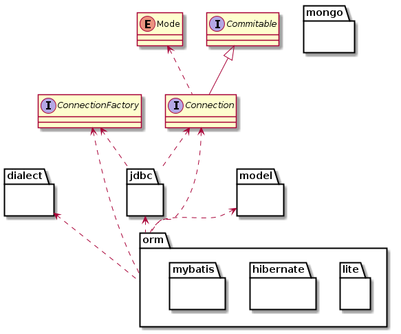
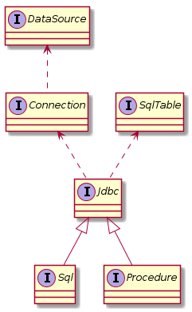

# Dao简介
Dao模块提供对数据持久化的支持，包含SQL、Hibernate、及一个简洁的ORM操作组件。Dao模块提供以下特性：
- 读写分离——自动区分读、写操作，并在执行时自动判断并使用相应的数据库连接；开发时无需关注读写分离，只需在发布时配置多个数据源即可。
- 读负载均衡——当配置了多个读数据连接时，将自动将请求分请求到不同的连接，以降低数据库压力。

在生产环境，通常建议对数据库做主从配置以降低风险，因此对持久化请求做读写分离可以有效降低数据库压力，保护数据；而一主多从的配置则更进一步降低数据库的读压力，保护数据库。

## Dao接口图

## Jdbc包接口图

## Orm包接口图

[连接工厂与连接](doc/connection.md "连接工厂与连接")

[管理数据源](doc/data-source.md "管理数据源")

[管理JDBC连接](doc/jdbc-connection.md "管理JDBC连接")

[执行SQL](doc/sql.md "执行SQL")

[Model定义](doc/model.md "Model定义")

[使用ModelHelper管理Model](doc/model-helper.md "使用ModelHelper管理Model")

[ORM接口说明](doc/orm.md "ORM接口说明")

[使用LiteOrm持久化数据](doc/lite.md "使用LiteOrm持久化数据")

[使用HibernateOrm持久化数据](doc/hibernate.md "使用HibernateOrm持久化数据")

[使用MybatisOrm持久化数据](doc/mybatis.md "使用MybatisOrm持久化数据")

[使用内存表映射提升检索速度](doc/memory.md "使用内存表映射提升检索速度")

[使用MongoDB持久化数据](doc/mongo.md "使用MongoDB持久化数据")

[dao.tephra.config.properties](doc/config.md "dao.tephra.config.properties")
